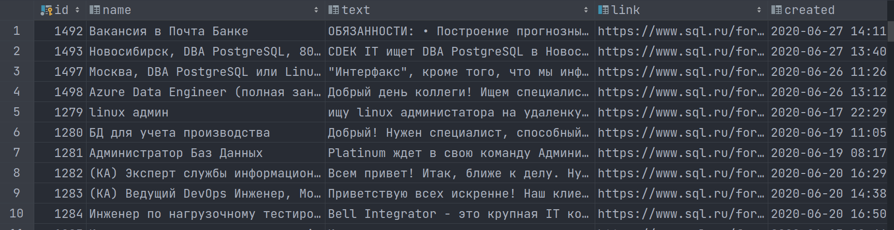
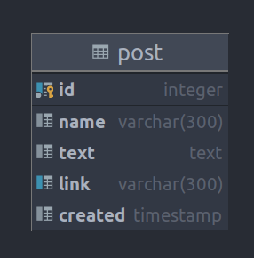

# Проект - Grabber

### Описание
Проект представляет собой парсер вакансий. Парсинг вакансий осуществляется с сайта: https://www.sql.ru/.
Распарсенные вакансии сохраняются в БД PostgreSQL.

Система запускается по расписанию, (данная функция реализована с помощью планировщика заданий Quartz), т. е. по истечению каждого периода запуска парсятся 5 страницы сайта вакансий и с помощью JDBC складируются в БД. 
Период запуска указывается в настройках - в файле app.properties (параметр time).
Доступ к интерфейсу сайта осуществляется через REST API с помощью библиотеки Jsoup (парсинг HTML).

### Технологии
- Java 13
- JDBC
- PostgreSQL
- Jsoup
- Планировщик заданий Quartz
- Sockets
- Maven
- JaCoCo
- Travis CI
- SLF4J

__Результат парсинга в БД__ 

__Структура таблицы БД__ 

#### Контакты

&nbsp;
&nbsp;